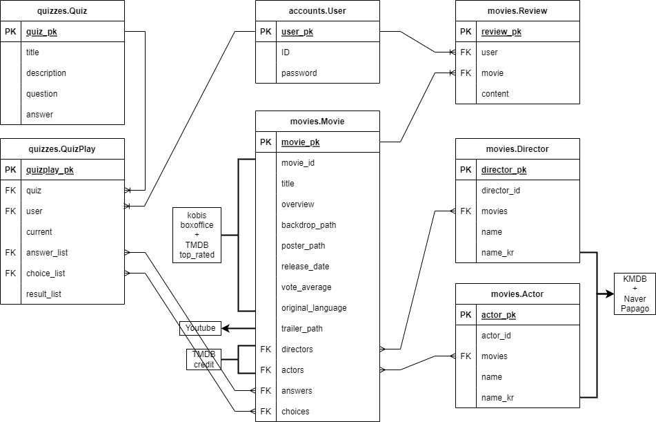
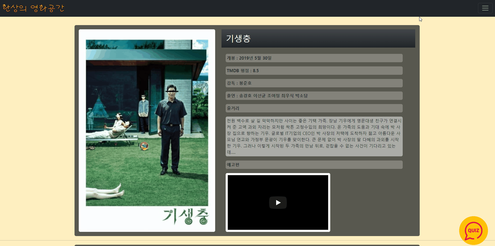

환상의 영화

## 프로젝트 소개 

> 영화 커뮤니티에서 '영잘알 퀴즈'를 풀어보고, 퀴즈에 나온 영화들을 자세히 살펴보자!!

#### - **프로젝트 기간** : 2022.05.20 - 2022.05.26 

#### - **팀원 정보 및 업무 분담 내역 👨‍👦**

​	**이재상** : DB 반영 / Movies BE / Quiz BE, FE

​	**김수환** : Account BE, FE / Movies FE / Quiz FE

#### - 프로젝트 규칙

- [x] 기술 스택 : django + bootstrap
- [x] 코드 스타일 : ***\*PEP 8 기본\****  https://candypoplatte.github.io/2018/10/10/django_coding_style/ 참조 
- [x] 깃 브랜칭 전략과 commit 컨벤션 : https://www.notion.so/Git-Commit-60c2e4a48e674b03a959ee5416db2146

#### - 데이터베이스 모델링(ERD)

------

## 필수 기능 설명

### - 🧾 Account 

- 메인 페이지의 toggle menu를 통해 account 관련 기능 접근  

**[회원가입]**

**[로그인]**

**[회원정보수정]**

### - 🎞 Movie  

**[메인 페이지]**

- 최신 영화 순으로 카드 제공
- 호버를 통한 디자인 구현

- 영화 예고편 모달 제공

**[상세 페이지]**

- 영화 상세 정보 제공

- 감독, 배우 관련 추천 영화 제공
- 유저들의 댓글 리뷰 작성 기능

### - 📝 Quiz 

- 메인 페이지의 quiz 아이콘을 통해 접근 가능  

**[싱글 모드]**

- 퀴즈 형식에 따라 랜덤 문제 생성
- 퀴즈 결과를 통해 추천 영화 제공

**[레크레이션 모드]**

- (미구현)